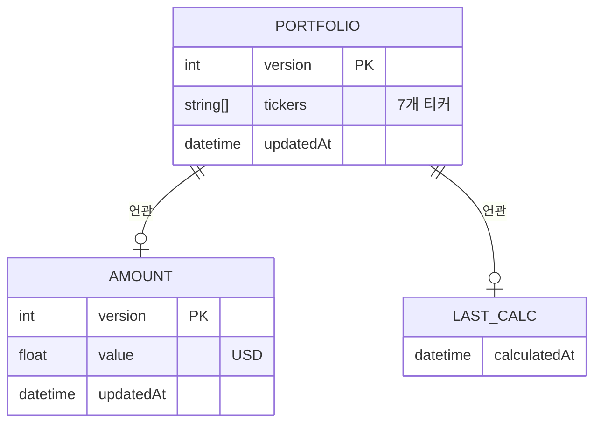

# Database Design: FAA Strategy Calculator

> Version: 1.0 | Date: 2026-01-07

---

## 1. 저장소 개요

### 아키텍처 결정
- **서버 DB**: 없음 (MVP 범위)
- **클라이언트 저장소**: Browser LocalStorage
- **데이터 영속성**: 브라우저/기기별 독립

### 제약 사항
| 항목 | 제한 |
|------|------|
| LocalStorage 용량 | 5MB (브라우저별) |
| 예상 사용량 | < 1KB |
| 동기화 | 불가 (기기별 독립) |

---

## 2. LocalStorage 스키마

### 2.1 키 구조

```
faa-calculator:portfolio  → 종목군 설정
faa-calculator:amount     → 투자 금액
faa-calculator:lastCalc   → 마지막 계산 시점
```

### 2.2 portfolio 구조

```typescript
// Key: "faa-calculator:portfolio"
interface PortfolioData {
  version: number;           // 스키마 버전 (마이그레이션용)
  tickers: string[];         // 7개 티커 배열
  updatedAt: string;         // ISO 8601 날짜
}

// 예시
{
  "version": 1,
  "tickers": ["VTI", "VEA", "VWO", "SHY", "BND", "GSG", "VNQ"],
  "updatedAt": "2026-01-07T22:00:00Z"
}
```

### 2.3 amount 구조

```typescript
// Key: "faa-calculator:amount"
interface AmountData {
  version: number;
  value: number;             // USD 금액
  updatedAt: string;
}

// 예시
{
  "version": 1,
  "value": 10000,
  "updatedAt": "2026-01-07T22:00:00Z"
}
```

### 2.4 lastCalc 구조

```typescript
// Key: "faa-calculator:lastCalc"
interface LastCalcData {
  calculatedAt: string;      // 마지막 계산 시점
}

// 예시
{
  "calculatedAt": "2026-01-07T22:00:00Z"
}
```

---

## 3. ERD (LocalStorage 관계)



---

## 4. 데이터 검증 규칙

| 필드 | 규칙 | 기본값 |
|------|------|--------|
| tickers | 길이 = 7, 각 항목 비어있지 않음 | 기본 종목군 |
| tickers[i] | 대문자 영문 1-5자 | - |
| amount.value | 양수, 최대 1억 | 10000 |
| version | 양의 정수 | 1 |

---

## 5. TypeScript 유틸리티

```typescript
// lib/localStorage.ts

const KEYS = {
  PORTFOLIO: 'faa-calculator:portfolio',
  AMOUNT: 'faa-calculator:amount',
  LAST_CALC: 'faa-calculator:lastCalc',
} as const;

const DEFAULT_TICKERS = ['VTI', 'VEA', 'VWO', 'SHY', 'BND', 'GSG', 'VNQ'];

export function getPortfolio(): string[] {
  const data = localStorage.getItem(KEYS.PORTFOLIO);
  if (!data) return DEFAULT_TICKERS;
  const parsed = JSON.parse(data);
  return parsed.tickers || DEFAULT_TICKERS;
}

export function savePortfolio(tickers: string[]): void {
  const data = {
    version: 1,
    tickers,
    updatedAt: new Date().toISOString(),
  };
  localStorage.setItem(KEYS.PORTFOLIO, JSON.stringify(data));
}

export function getAmount(): number {
  const data = localStorage.getItem(KEYS.AMOUNT);
  if (!data) return 10000;
  const parsed = JSON.parse(data);
  return parsed.value || 10000;
}

export function saveAmount(value: number): void {
  const data = {
    version: 1,
    value,
    updatedAt: new Date().toISOString(),
  };
  localStorage.setItem(KEYS.AMOUNT, JSON.stringify(data));
}

export function clearAll(): void {
  Object.values(KEYS).forEach(key => localStorage.removeItem(key));
}
```

---

## 6. 마이그레이션 전략

### 버전 업그레이드 시
```typescript
function migrateData(): void {
  const portfolio = localStorage.getItem(KEYS.PORTFOLIO);
  if (!portfolio) return;
  
  const data = JSON.parse(portfolio);
  
  // v1 → v2 마이그레이션 예시
  if (data.version === 1) {
    data.version = 2;
    // 새 필드 추가 등
    localStorage.setItem(KEYS.PORTFOLIO, JSON.stringify(data));
  }
}
```

---

## 7. REQ ↔ 스키마 매핑

| REQ ID | 요구사항 | 스키마 |
|--------|----------|--------|
| REQ-1.4 | 종목군 브라우저 저장 | portfolio |
| REQ-3.1 | 투자 금액 입력 | amount |
| FEAT-1 | 재방문 시 복원 | portfolio + amount |
