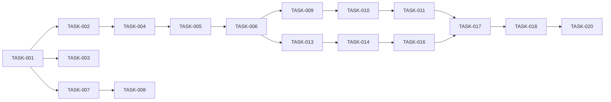

# TASKS: FAA Strategy Calculator

> AI 개발 파트너용 태스크 목록  
> Version: 1.0 | Date: 2026-01-07

---

## Milestone 0: 프로젝트 세팅 (1일)

### [TASK-001] Next.js 프로젝트 초기화

**Context**: [TRD.md - Section 6, 10](file:///Users/yunjihwan/.gemini/antigravity/brain/9d420c35-8a71-4e40-8d28-3bc9f52216cb/TRD.md)

**작업 내용**:
- Next.js 14+ 프로젝트 생성 (App Router)
- TypeScript 설정
- Tailwind CSS + shadcn/ui 설치
- 기본 폴더 구조 생성

**Files**:
```
/
├── app/
│   ├── layout.tsx
│   ├── page.tsx
│   └── globals.css
├── components/
│   └── ui/
├── lib/
├── package.json
├── tailwind.config.js
└── tsconfig.json
```

**Acceptance Criteria**:
- [ ] `npm run dev` 실행 시 정상 작동
- [ ] shadcn/ui Button 컴포넌트 렌더링 확인
- [ ] Tailwind 스타일 적용 확인

**Self-review**:
- [ ] TypeScript strict 모드 활성화
- [ ] ESLint 설정 완료

---

### [TASK-002] Vercel Python Runtime 설정

**Context**: [TRD.md - Section 1](file:///Users/yunjihwan/.gemini/antigravity/brain/9d420c35-8a71-4e40-8d28-3bc9f52216cb/TRD.md)

**작업 내용**:
- vercel.json 설정
- Python API 폴더 구조 생성
- requirements.txt 작성

**Files**:
```
/
├── api/
│   └── hello.py          # 테스트용
├── requirements.txt
└── vercel.json
```

**Acceptance Criteria**:
- [ ] `vercel dev` 로컬 실행 확인
- [ ] /api/hello 엔드포인트 응답 확인

---

### [TASK-003] LocalStorage 유틸리티 구현

**Context**: [DATABASE_DESIGN.md](file:///Users/yunjihwan/.gemini/antigravity/brain/9d420c35-8a71-4e40-8d28-3bc9f52216cb/DATABASE_DESIGN.md)

**Files**: `lib/localStorage.ts`

**Acceptance Criteria**:
- [ ] getPortfolio, savePortfolio 함수 구현
- [ ] getAmount, saveAmount 함수 구현
- [ ] clearAll 함수 구현
- [ ] 단위 테스트 작성

---

## Milestone 1: 스코어 계산 API (2일)

### [TASK-004] 티커 검증 API (/api/validate-ticker)

**Context**: [TRD.md - Section 5.2](file:///Users/yunjihwan/.gemini/antigravity/brain/9d420c35-8a71-4e40-8d28-3bc9f52216cb/TRD.md)

**Files**: `api/validate_ticker.py`

**API Contract**:
```python
# POST /api/validate-ticker
# Request: {"ticker": "VTI"}
# Response: {"valid": true, "name": "...", "exchange": "..."}
```

**Acceptance Criteria**:
- [ ] 유효한 티커 → valid: true + 종목명 반환
- [ ] 무효한 티커 → valid: false
- [ ] 응답 시간 < 2초

---

### [TASK-005] FAA 스코어 계산 로직 구현

**Context**: [PRD.md - Section 9](file:///Users/yunjihwan/.gemini/antigravity/brain/9d420c35-8a71-4e40-8d28-3bc9f52216cb/PRD.md)

**Files**: `api/faa_calculator.py` (내부 모듈)

**구현 공식**:
```python
# 모멘텀 = (현재가 / 4개월전가격) - 1
# 변동성 = std(일별 수익률, 80일)
# 상관성 = sum(corr(asset_i, asset_j))
# 통합점수 = M순위*1.0 + V순위*0.5 + C순위*0.5
```

**Acceptance Criteria**:
- [ ] 모멘텀 계산 정확성 (수동 검증)
- [ ] 변동성 계산 정확성
- [ ] 상관성 계산 정확성
- [ ] 순위 산정 정확성
- [ ] 단위 테스트 작성

---

### [TASK-006] 스코어 API 엔드포인트 (/api/score)

**Context**: [TRD.md - Section 5.2](file:///Users/yunjihwan/.gemini/antigravity/brain/9d420c35-8a71-4e40-8d28-3bc9f52216cb/TRD.md)

**Files**: `api/score.py`

**Acceptance Criteria**:
- [ ] 7개 티커 입력 → 스코어 계산 결과 반환
- [ ] 상위 3개 종목 선정
- [ ] 절대 모멘텀 필터 적용
- [ ] 투자 배분 계산
- [ ] 응답 시간 < 10초

---

## Milestone 2: 메인 UI (2일)

### [TASK-007] 레이아웃 및 헤더 컴포넌트

**Context**: [DESIGN_SYSTEM.md](file:///Users/yunjihwan/.gemini/antigravity/brain/9d420c35-8a71-4e40-8d28-3bc9f52216cb/DESIGN_SYSTEM.md)

**Files**: 
- `app/layout.tsx`
- `components/Header.tsx`

**Acceptance Criteria**:
- [ ] 반응형 레이아웃
- [ ] 로고/타이틀 표시
- [ ] 메인/백테스트 탭 네비게이션

---

### [TASK-008] TickerInput 컴포넌트

**Context**: [USER_FLOW.md - Section 2](file:///Users/yunjihwan/.gemini/antigravity/brain/9d420c35-8a71-4e40-8d28-3bc9f52216cb/USER_FLOW.md)

**Files**: `components/TickerInput.tsx`

**상태**: empty, validating, valid, invalid

**Acceptance Criteria**:
- [ ] 7개 입력 필드 렌더링
- [ ] 입력 시 실시간 검증 (debounce 300ms)
- [ ] 상태별 UI 표시
- [ ] 기본값 채우기 버튼

---

### [TASK-009] ScoreTable 컴포넌트

**Context**: [PRD.md - REQ-4.1~4.3](file:///Users/yunjihwan/.gemini/antigravity/brain/9d420c35-8a71-4e40-8d28-3bc9f52216cb/PRD.md)

**Files**: `components/ScoreTable.tsx`

**표시 항목**:
- 티커, 모멘텀, 변동성, 상관성
- 각 순위, 통합점수
- 선정 여부 (하이라이트)
- 현금 대체 라벨

**Acceptance Criteria**:
- [ ] 테이블 정렬 (통합점수순)
- [ ] 상위 3개 하이라이트
- [ ] 모바일 반응형

---

### [TASK-010] AllocationResult 컴포넌트

**Context**: [PRD.md - REQ-3.1~3.3](file:///Users/yunjihwan/.gemini/antigravity/brain/9d420c35-8a71-4e40-8d28-3bc9f52216cb/PRD.md)

**Files**: `components/AllocationResult.tsx`

**Acceptance Criteria**:
- [ ] 금액 입력 필드 (USD)
- [ ] 종목별 배분 금액 표시
- [ ] LocalStorage 저장

---

### [TASK-011] 메인 페이지 통합

**Files**: `app/page.tsx`

**Acceptance Criteria**:
- [ ] TickerInput → ScoreTable → AllocationResult 흐름
- [ ] 로딩/에러 상태 처리
- [ ] LocalStorage 복원

---

## Milestone 3: 투자 배분 (1일)

### [TASK-012] 배분 계산 로직 완성

**Context**: [PRD.md - FEAT-3](file:///Users/yunjihwan/.gemini/antigravity/brain/9d420c35-8a71-4e40-8d28-3bc9f52216cb/PRD.md)

**작업 내용**: API에서 계산된 배분 결과를 UI에 표시

**Acceptance Criteria**:
- [ ] 균등 배분 표시
- [ ] 소수점 2자리 표시 ($3,333.33)
- [ ] 합계 검증

---

## Milestone 4: 백테스트 (2일)

### [TASK-013] 백테스트 API (/api/backtest)

**Context**: [TRD.md - Section 5.2](file:///Users/yunjihwan/.gemini/antigravity/brain/9d420c35-8a71-4e40-8d28-3bc9f52216cb/TRD.md)

**Files**: `api/backtest.py`

**Acceptance Criteria**:
- [ ] 시작일~현재 시뮬레이션
- [ ] 월별 리밸런싱 실행
- [ ] 누적 수익률 계산
- [ ] CAGR, MDD, Sharpe 계산
- [ ] 응답 시간 < 10초 (5년)

---

### [TASK-014] BacktestChart 컴포넌트

**Context**: [PRD.md - REQ-5.3~5.5](file:///Users/yunjihwan/.gemini/antigravity/brain/9d420c35-8a71-4e40-8d28-3bc9f52216cb/PRD.md)

**Files**: `components/BacktestChart.tsx`

**사용 라이브러리**: Recharts

**Acceptance Criteria**:
- [ ] 누적 수익률 Line Chart
- [ ] SPY 벤치마크 오버레이
- [ ] 툴팁 (날짜, 가치, 수익률)
- [ ] 반응형

---

### [TASK-015] MetricCard 컴포넌트

**Files**: `components/MetricCard.tsx`

**표시 지표**: CAGR, MDD, Sharpe Ratio

**Acceptance Criteria**:
- [ ] 3개 지표 카드
- [ ] 숫자 포맷팅 (%, 소수점)

---

### [TASK-016] 백테스트 페이지

**Files**: `app/backtest/page.tsx`

**Acceptance Criteria**:
- [ ] 시작일 DatePicker
- [ ] 백테스트 실행 버튼
- [ ] 차트 + 지표 표시
- [ ] 로딩/에러 상태

---

## Milestone 5: 광고 통합 (0.5일)

### [TASK-017] AdSense 배너 추가

**Context**: [PRD.md - FEAT-6](file:///Users/yunjihwan/.gemini/antigravity/brain/9d420c35-8a71-4e40-8d28-3bc9f52216cb/PRD.md)

**Files**: 
- `components/AdBanner.tsx`
- `app/layout.tsx`

**Acceptance Criteria**:
- [ ] 헤더/푸터 광고 슬롯
- [ ] 콘텐츠 가리지 않음
- [ ] 모바일 대응

---

## Milestone 6: QA & 배포 (1.5일)

### [TASK-018] 단위 테스트 작성

**Files**: `__tests__/`

**테스트 대상**:
- FAA 계산 로직
- LocalStorage 유틸리티

**Acceptance Criteria**:
- [ ] 핵심 로직 테스트 커버리지 > 80%

---

### [TASK-019] 수동 테스트

**테스트 케이스**:
1. 기본 종목으로 스코어 계산
2. 커스텀 종목 입력 및 검증
3. 투자 금액 배분
4. 5년 백테스트 실행
5. LocalStorage 복원

---

### [TASK-020] 프로덕션 배포

**작업 내용**:
- Vercel 프로젝트 연결
- 환경 변수 설정 (필요시)
- 배포 확인

**Acceptance Criteria**:
- [ ] Production URL 접속 가능
- [ ] 모든 API 정상 작동
- [ ] 모바일/데스크톱 UI 확인

---

## 태스크 의존성


