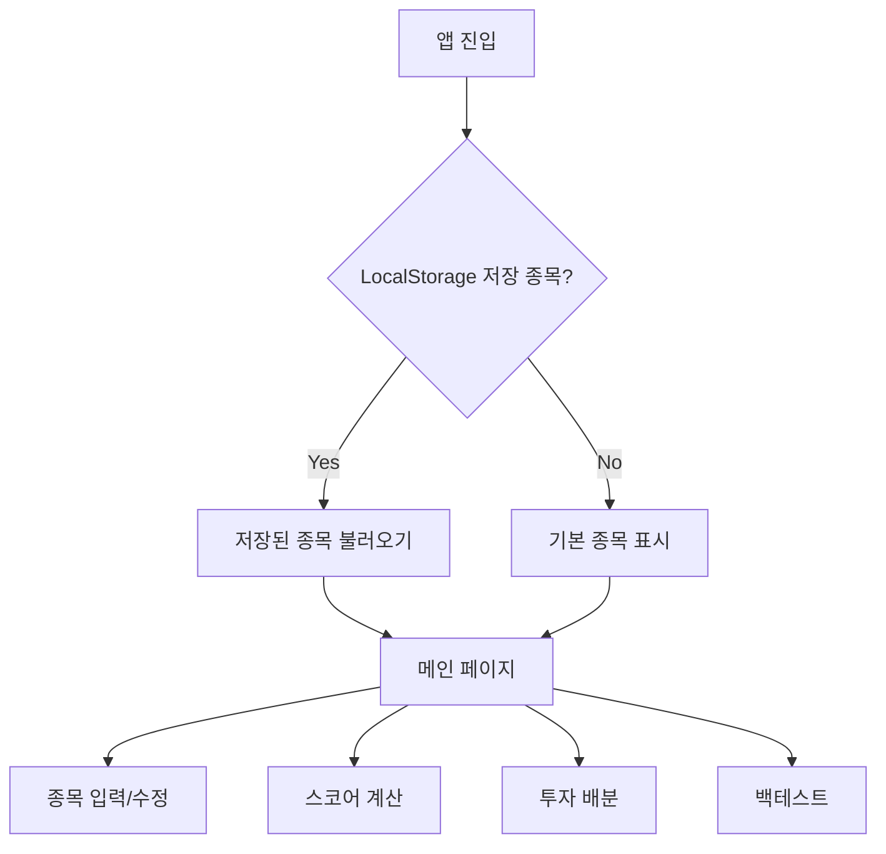
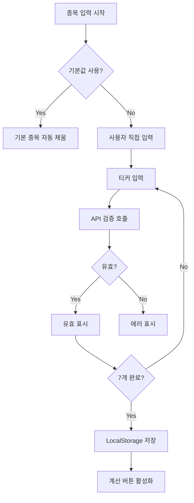
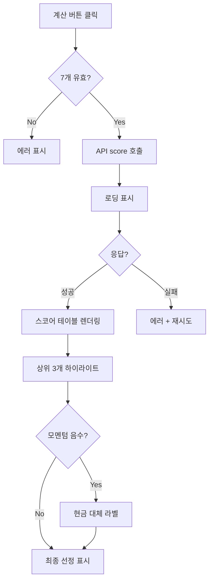
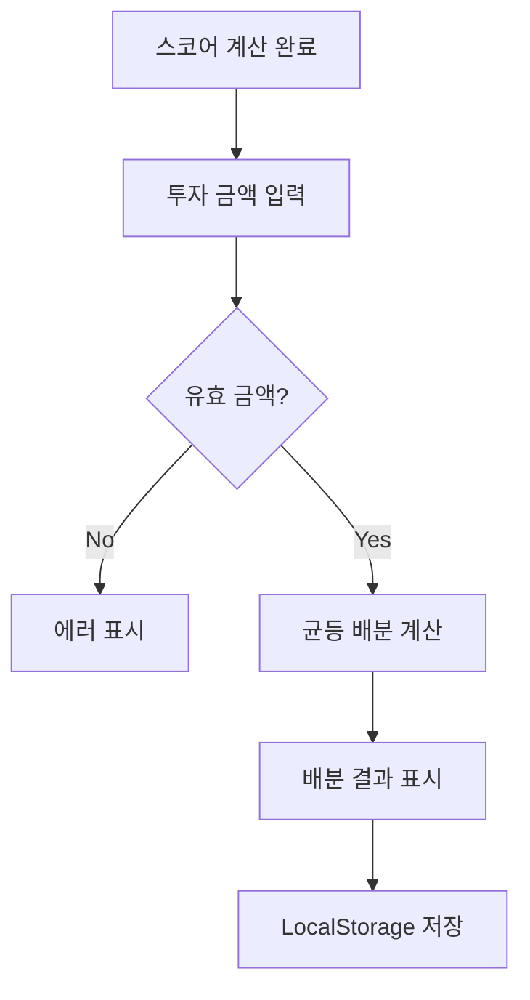
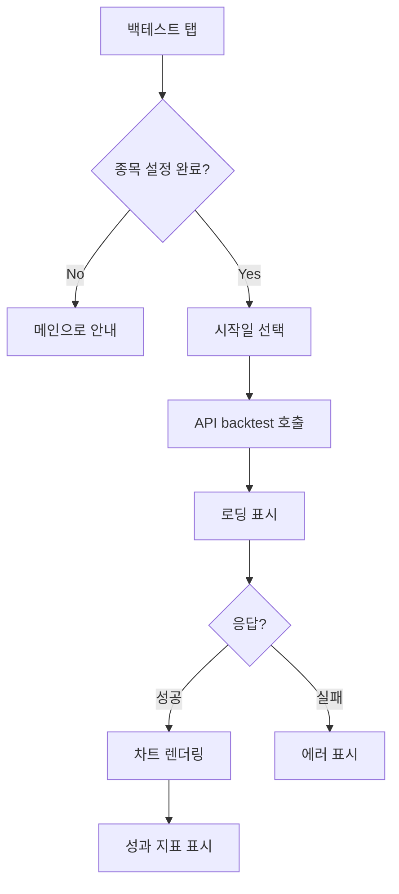
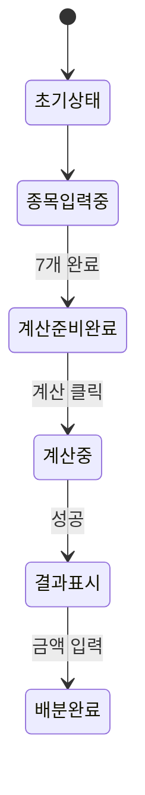

# User Flow: FAA Strategy Calculator

> Version: 1.0 | Date: 2026-01-07

---

## 1. 전체 사용자 여정

---

## 2. 종목 입력 플로우 (FEAT-1)

---

## 3. 스코어 계산 플로우 (FEAT-2)

---

## 4. 투자 배분 플로우 (FEAT-3)

---

## 5. 백테스트 플로우 (FEAT-5)

---

## 6. 메인 페이지 상태

---

## REQ ↔ Flow 매핑

| REQ ID | 요구사항 | 플로우 |
|--------|----------|--------|
| REQ-1.1~1.4 | 종목 입력/검증 | 종목 입력 플로우 |
| REQ-2.1~2.7 | FAA 스코어 계산 | 스코어 계산 플로우 |
| REQ-3.1~3.3 | 투자 배분 | 투자 배분 플로우 |
| REQ-5.1~5.5 | 백테스트 | 백테스트 플로우 |
